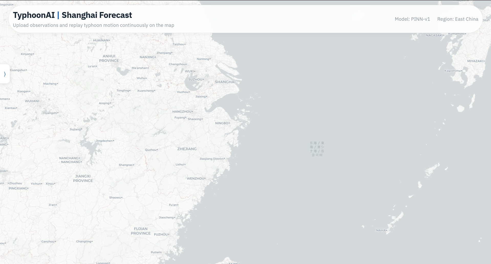
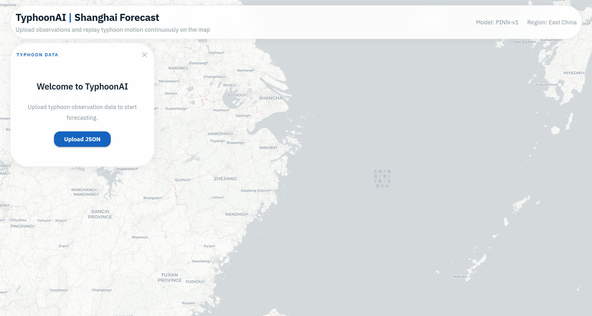
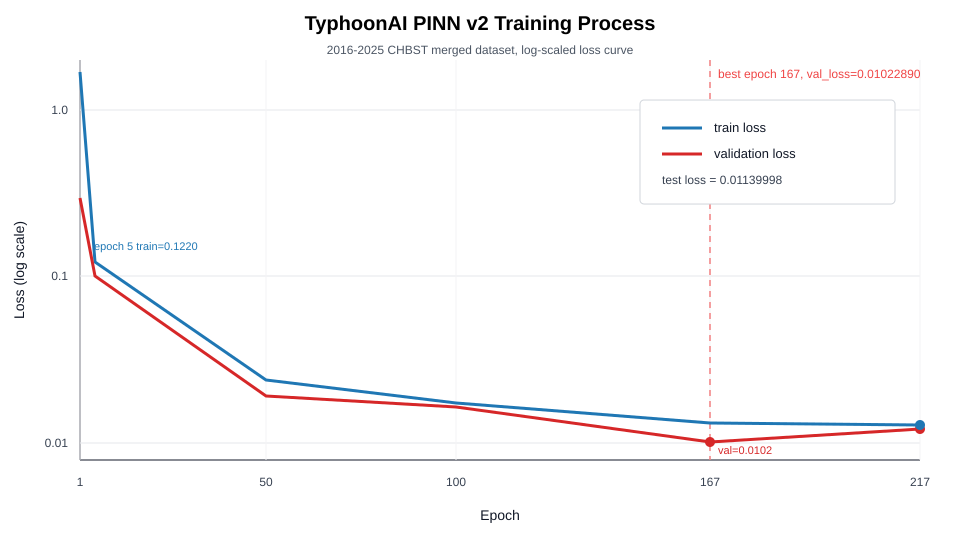
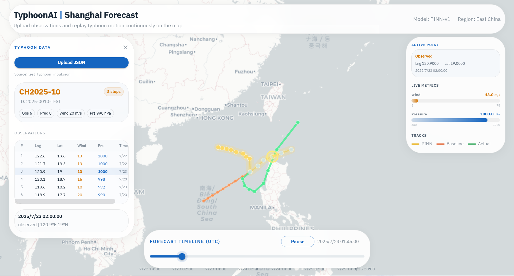

# TyphoonAI: Research Report on Typhoon Trajectory Prediction Based on PINN

## 1. Introduction

AI for Science uses artificial intelligence to support scientific modeling. Typhoon trajectory prediction is a suitable course project because it has clear historical observations and is also affected by physical factors such as Earth rotation, motion inertia, land-sea distribution, and intensity change.

TyphoonAI is a typhoon trajectory prediction and visualization system based on a Physics-Informed Neural Network (PINN). The input is a recent typhoon observation sequence, including relative time, longitude, latitude, maximum wind speed, and central pressure. The output is the future typhoon center position, wind speed, pressure, and local velocity components. Compared with a normal regression model, this project adds constraints related to velocity, inertia, Coriolis force, wind-pressure coupling, and nearshore decay, so that the model can reduce unreasonable track jumps and intensity changes.

The main work of this project includes three parts. First, the CHBST typhoon best-track data from 2016 to 2025 is merged, cleaned, normalized, converted into sequence samples, and split into training, validation, and test sets by typhoon ID. Second, a 4-layer MLP PINN is implemented with data fitting and physics-informed loss terms. Third, the trained `typhoon_pinn_v2.pth` model is connected to a Flask backend and a React/DeckGL frontend, supporting JSON upload, PINN prediction, comparison with a linear smoothing baseline, and map visualization.

## 2. Dataset and Data Processing

### 2.1 Data Source

The final version of the project uses 10 CHBST best-track CSV files from 2016 to 2025 under `train/dataset/`. According to `backend/models/weights/typhoon_pinn_v2.summary.json`, the raw dataset has 8871 rows, and the number of rows after preprocessing is still 8871. This means no sample is removed after key-field cleaning.

| Dataset File | Rows |
|---|---:|
| `CH2016BST_pinn_dataset.csv` | 725 |
| `CH2017BST_pinn_dataset.csv` | 827 |
| `CH2018BST_pinn_dataset.csv` | 1251 |
| `CH2019BST_pinn_dataset.csv` | 1003 |
| `CH2020BST_pinn_dataset.csv` | 733 |
| `CH2021BST_pinn_dataset.csv` | 926 |
| `CH2022BST_pinn_dataset.csv` | 741 |
| `CH2023BST_pinn_dataset.csv` | 789 |
| `CH2024BST_pinn_dataset.csv` | 877 |
| `CH2025BST_pinn_dataset.csv` | 999 |

The merged dataset contains 287 typhoons and 8871 observation points. Each typhoon has 7 to 91 points, with an average of 30.91 points. The time intervals are mainly 3 hours and 6 hours, appearing 1413 and 7171 times respectively. Therefore, the real time interval must be kept during training instead of treating all adjacent points as fixed steps.

| Field | Minimum | Maximum | Meaning |
|---|---:|---:|---|
| `t_hours` | 0.0 | 510.0 | Hours since the first observation of the typhoon |
| `lng` | 97.8 | 255.0 | Typhoon center longitude |
| `lat` | 3.4 | 70.1 | Typhoon center latitude |
| `wind_speed` | 10.0 | 75.0 | Maximum wind speed, in m/s |
| `pressure` | 890.0 | 1014.0 | Central pressure, in hPa |

### 2.2 Data Preprocessing Pipeline

Data preprocessing is implemented in `train/train_pinn.py`. The final training script can read a single CSV/JSON/JSONL file, and it can also receive a directory path and merge all supported dataset files in that directory. The v2 model is trained with the directory path `train/dataset`.

| Step | Processing Details |
|---|---|
| Data loading | CSV files are read with `utf-8-sig`, which handles UTF-8 BOM headers. In directory mode, supported files are sorted and merged. |
| Field validation | The training data must contain `storm_id`, `lng`, `lat`, `wind_speed`, `pressure`, and either `t_hours` or `timestamp`. |
| Time processing | If only `timestamp` is available, the script computes `t_hours` within each typhoon relative to the first observation. |
| Numeric cleaning | `t_hours`, longitude, latitude, wind speed, and pressure are converted to numeric values. Invalid values become missing values and are removed. |
| Extra fields | Non-training fields such as `source_file` and `storm_name` are removed if they exist. |
| Sorting and deduplication | Duplicate records are removed by `storm_id` and `t_hours`, keeping the last record. The data is then sorted by typhoon ID and time. |
| Normalization | `TensorScaler` applies min-max scaling to `[-1, 1]` for `t_hours`, `lng`, `lat`, `wind_speed`, and `pressure`. The scaler is fitted only on the training set. |

This pipeline has two important effects. First, directory merging covers 10 years of data and improves sample coverage. Second, the scaler is fitted only on the training set and then reused on validation and test sets, avoiding data leakage.

### 2.3 Sequence Sample Construction

The model input is not a single point, but a historical window of 4 observation points. Each point has 5 features, so the input dimension is:

```text
4 * 5 = 20
```

For a typhoon track with length `N`, the script constructs `N - 4` supervised samples. Each sample uses the previous 4 points as input and the next point as the target:

```text
(lng, lat, wind_speed, pressure)
```

`TyphoonSequenceDataset` also stores raw target state, last state, previous state, `dt_hours`, and `previous_dt_hours`. These raw values are not directly fed into the neural network, but they are used to compute velocity, acceleration, and Coriolis-related losses in real units. This keeps the input simple while allowing physical losses to be computed outside normalized space.

### 2.4 Training/Validation/Test Split

The final training process splits data by typhoon ID instead of randomly splitting sliding-window samples. This avoids assigning highly similar windows from the same typhoon to both training and validation sets.

The script first uses `test_ratio=0.1` to hold out a test set from 287 typhoons, and then uses `val_ratio=0.2` on the remaining typhoons to build the validation set. The random seed is 42.

| Split | Typhoons | Raw Points | Sequence Samples |
|---|---:|---:|---:|
| Training | 206 | 6520 | 5696 |
| Validation | 52 | 1484 | 1276 |
| Test | 29 | 867 | 751 |

The final dataset covers more years and more typhoon cases than the earlier single-year version. However, it is still low-dimensional best-track data. It contains position, wind speed, and pressure, but not sea surface temperature, environmental wind fields, humidity, or other spatial meteorological fields. Therefore, this project is closer to short-term prediction based on historical trajectory and intensity sequences, not a full numerical weather prediction system.

## 3. Method

### 3.1 Model Architecture

The model is defined in `backend/models/pinn_model.py`, and the main class is `TyphoonPINN`. It is a 4-layer fully connected MLP with 3 hidden linear layers and 1 output layer. The hidden dimension is 128, the activation function is `Tanh`, the input dimension is 20, and the output dimension is 6.

| Output Variable | Meaning |
|---|---|
| `lng` | Next-step typhoon center longitude |
| `lat` | Next-step typhoon center latitude |
| `wind_speed` | Next-step maximum wind speed |
| `pressure` | Next-step central pressure |
| `u_mps` | East-west velocity component, in m/s |
| `v_mps` | North-south velocity component, in m/s |

The first four output variables are passed through `tanh` and limited to the normalized `[-1, 1]` state space. The two velocity components use `80.0 * tanh(...)`, so their range is approximately `[-80, 80] m/s`. This reduces the risk of producing extreme values during inference.

### 3.2 Loss Function

The final loss function is `PINNLoss`. It contains a data fitting term and five categories of physical or motion constraints. In the implementation, the velocity category is divided into velocity consistency and velocity supervision, so the total loss has 1 data term and 6 constraint terms:

```text
L_total = L_data
        + 1e-3 * L_velocity_consistency
        + 1e-3 * L_velocity_supervised
        + 1e4 * L_inertia
        + 1e4 * L_coriolis
        + 0.05 * L_wind_pressure
        + 0.02 * L_nearshore
```

| Loss Term | Role |
|---|---|
| Data fitting | Mean squared error between the predicted normalized state and the true next-step state. |
| Velocity consistency | Aligns model-output velocity with velocity derived from the previous position and predicted position. |
| Velocity supervision | Aligns model-output velocity with the true next-step motion from the previous position to the target position. |
| Inertia | Penalizes large acceleration and reduces sudden turns or oscillations. |
| Coriolis force | Uses `f = 2 * Omega * sin(lat)` to build a weak residual for rotating Earth motion. |
| Wind-pressure coupling | Penalizes cases where wind speed and pressure change in the same direction. |
| Nearshore decay | Uses a simplified coastline function to discourage unrealistic strengthening near land. |

The simplified coastline function is:

```text
coast_lng = 120.35 + 0.19 * (lat - 26.0) + 0.08 * sin((lat - 26.0) * 1.6)
```

These constraints are weak physical priors rather than full atmospheric dynamics equations. Their main purpose is to help the model avoid clearly unreasonable movement and intensity patterns under low-dimensional input conditions.

### 3.3 Training Configuration

The final training result comes from `backend/models/weights/typhoon_pinn_v2.summary.json`. Training uses CPU, Adam optimizer, learning rate 0.001, batch size 32, random seed 42, gradient clipping 1.0, maximum 300 epochs, early stopping patience 50, and `min_delta=0.0001`. The monitored metric is validation total loss `val_loss`.

| Parameter | Value |
|---|---:|
| Input sequence length | 4 |
| Input dimension | 20 |
| Hidden dimension | 128 |
| Output dimension | 6 |
| Maximum epochs | 300 |
| Completed epochs | 217 |
| Best epoch | 167 |
| Best validation loss | 0.01022890 |
| Training samples | 5696 |
| Validation samples | 1276 |
| Test samples | 751 |

### 3.4 Inference Mechanism

The inference logic is located in `backend/logic/pinn_inference.py`. The backend loads `backend/models/weights/typhoon_pinn_v2.pth` by default. After the frontend uploads JSON data, the backend parses fields such as `storm_id`, `storm_name`, `basin`, `forecast_steps`, `time_step_hours`, and `observations`. `forecast_steps` is limited to 1-24, and `time_step_hours` is limited to 1-6 hours.

PINN inference is autoregressive. The system uses the latest 4 observations as input. If fewer than 4 observations are available, the earliest observation is used for padding. After predicting one step, the predicted point is appended to the history and used for the next step.

For comparison, the backend also computes a linear smoothing baseline. This baseline estimates the recent changing rates of longitude, latitude, wind speed, and pressure from up to 5 observations, then applies the damping coefficient `0.92^(step-1)`. If the uploaded data contains `actual_track`, the backend can calculate PINN errors and baseline errors. The files `real_typhoon_muifa_2022.json`, `real_typhoon_hinnamnor_2022.json`, and `real_typhoon_doksuri_2023.json` are examples with real future tracks.

## 4. System Architecture

This system has three layers: training layer, backend service layer, and frontend visualization layer.

The training layer uses PyTorch. The main files are `train/train_pinn.py` and `backend/models/pinn_model.py`. The training script merges directory datasets, preprocesses records, splits data by typhoon ID, builds sequence samples, trains the PINN, applies early stopping, and saves `typhoon_pinn_v2.pth` and `typhoon_pinn_v2.summary.json`.

The backend service layer uses Flask. The entry file is `backend/app.py`, and routes are defined in `backend/api/routes.py`. The main interfaces are `GET /api/health`, `POST /api/predict_typhoon`, and `GET /api/get_weather_conditions`. The prediction API returns observed tracks, PINN predicted tracks, linear smoothing baseline tracks, physical loss breakdown, metric summary, and weather context.

The frontend visualization layer uses React 19, DeckGL 9, MUI 7, and Vite. `MapScene.jsx` renders the map and track layers, `ForecastSidebar.jsx` handles JSON upload and observation display, `MapLegend.jsx` shows PINN, Baseline, and Actual legends, and `TimelineBar.jsx` supports timeline replay.

The data flow is:

```text
Typhoon observation JSON
    -> React frontend upload
    -> Flask /api/predict_typhoon
    -> PINN inference and linear smoothing baseline calculation
    -> Return tracks, losses, metrics, and weather context
    -> DeckGL map and sidebar visualization
```

**Initial Frontend Interface Screenshot:**



**Input Data Section Screenshot:**



## 5. Experimental Results and Analysis

### 5.1 Training Process



The training curve shows fast early convergence. At epoch 1, training loss is 1.67850671 and validation loss is 0.29562713. At epoch 5, training loss decreases to 0.12198998 and validation loss decreases to 0.10129702. At epoch 50, validation loss further decreases to 0.01911666. The best validation loss appears at epoch 167, with `val_loss = 0.01022890`. Training stops at epoch 217 because no further improvement satisfies the early-stopping threshold.

Compared with the earlier single-year training result, v2 uses much more data and has more reliable evaluation. The test mean position error is about 56.45 km, showing that the model has short-term prediction ability on unseen typhoons.

### 5.2 Physical Consistency Analysis

At the best epoch, validation data loss is 0.00243342, meaning the model fits the next-step normalized state well. The validation velocity consistency loss is 1.54998314, contributing about 0.00155 after weighting. The velocity supervised loss is 4.28436171, contributing about 0.00428. This shows that explicit velocity prediction is an important part of the model.

The raw inertia and Coriolis losses are small, but their weights are `1e4`, so they still constrain training. The validation wind-pressure loss is 0.00020964, and the nearshore decay loss is 0.00821889. This suggests that most predictions do not strongly violate intensity-change rules, while nearshore behavior is still a difficult part of the task.

### 5.3 Trajectory Visualization

The frontend displays the observed track and PINN predicted track as the main path, and also overlays the linear smoothing baseline. If the uploaded data contains `actual_track`, the real future track is displayed as well. This makes it possible to compare path curvature, movement speed, final position, and intensity changes. For typhoon prediction, the map shape is important because a single loss value cannot fully describe sudden turns or abnormal jumps.

**Trajectory Visualization Screenshot:**

### 5.4 Quantitative Metrics

The training summary already stores validation and test metrics. The test set contains 29 unseen typhoons and 751 sequence samples, so it provides a more credible generalization estimate than training loss alone.

| Metric | Test Set Value |
|---|---:|
| Total loss | 0.01139998 |
| Mean position error km | 56.45334443 |
| Median position error km | 45.44064331 |
| Position RMSE km | 70.68164170 |
| Wind MAE m/s | 1.55819084 |
| Pressure MAE hPa | 3.09494689 |
| Data loss | 0.00224289 |
| Velocity consistency loss | 1.28142268 |
| Velocity supervised loss | 5.58214635 |

## 6. Discussion

### 6.1 Role of Physical Constraints

Physical constraints have three roles in this project. First, they provide inductive bias under limited low-dimensional input. Second, they make position changes, velocity output, and intensity changes more consistent. Third, they provide an analysis basis for comparing the PINN result with the linear smoothing baseline.

These constraints are still weak priors. They do not use real three-dimensional atmospheric fields or solve complete dynamical equations. The nearshore term uses a simplified coastline function, and the Coriolis term is only a local residual based on velocity and acceleration. Therefore, they cannot replace operational numerical weather prediction.

### 6.2 Insights from Data-Driven Modeling

The v2 result shows that expanding the dataset improves both performance and credibility. The final dataset contains 287 typhoons and uses ID-level train/validation/test splitting. The test mean position error is about 56.45 km, showing that the model has some generalization ability on unseen typhoons.

At the same time, the data is still low-dimensional best-track data. The model does not see sea surface temperature, environmental wind fields, vertical wind shear, subtropical high pressure, or humidity fields. This limits its ability to explain complex turning and rapid intensity change. For AI for Science tasks, data-driven models need richer scientific observations and physical variables.

### 6.3 Limitations

- Limited input features: the model only uses time, longitude, latitude, wind speed, and pressure, without spatial atmospheric or ocean variables.
- Simple prediction mechanism: multi-step prediction is autoregressive, so errors may accumulate as the forecast horizon increases.
- Lightweight model structure: the 4-layer MLP is easy to train and deploy, but it has limited ability to model long-term dependencies and complex environments.
- Simplified physical constraints: Coriolis and nearshore decay are weak priors and cannot fully describe typhoon dynamics.
- Baseline experiments can be expanded: the system supports PINN-baseline comparison, but the repository does not save a batch comparison table for multiple cases.

## 7. Team Division

| Member | Student ID | Main Work |
|---|---|---|
| 王雷 | 2351299 | Topic selection, requirement analysis, overall design, backend implementation, PINN inference, and linear smoothing baseline comparison logic. |
| 黄景胤 | 2351129 | Dataset organization and preprocessing, including 2016-2025 CHBST data merging, field standardization, ID-level splitting, and sample statistics. |
| 周达 | 2354185 | Model and training work, including MLP-PINN implementation, physical loss design, v2 training configuration, early stopping, and result analysis. |
| 林琪 | 2352609 | React/DeckGL frontend visualization, runtime screenshots, project demonstration, and report writing. |
